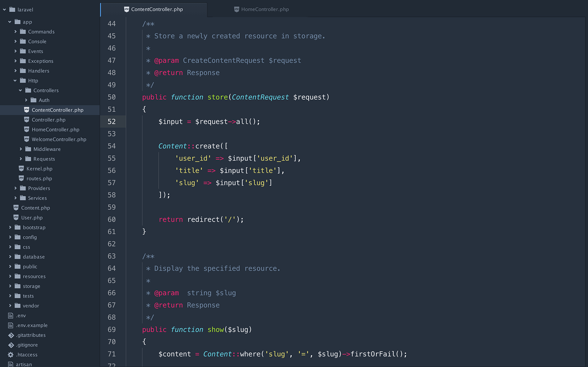

# Monokai Galaxy Syntax for Atom One Dark UI Theme
Monokai Galaxy syntax theme for Atom to work with [One Dark UI Theme](https://atom.io/themes/one-dark-ui).

Ported the [Monokai Syntax for Atom One Dark UI Theme](https://github.com/saschaeggi/monokai-syntax-for-one-dark) by [Sascha Eggenberger](https://github.com/saschaeggi) which ported the [Proton Monokai](https://github.com/jdsimcoe/proton-kai) Version from [jdsimcoe](https://github.com/jdsimcoe) to fit the [One Dark UI Theme](https://atom.io/themes/one-dark-ui).

